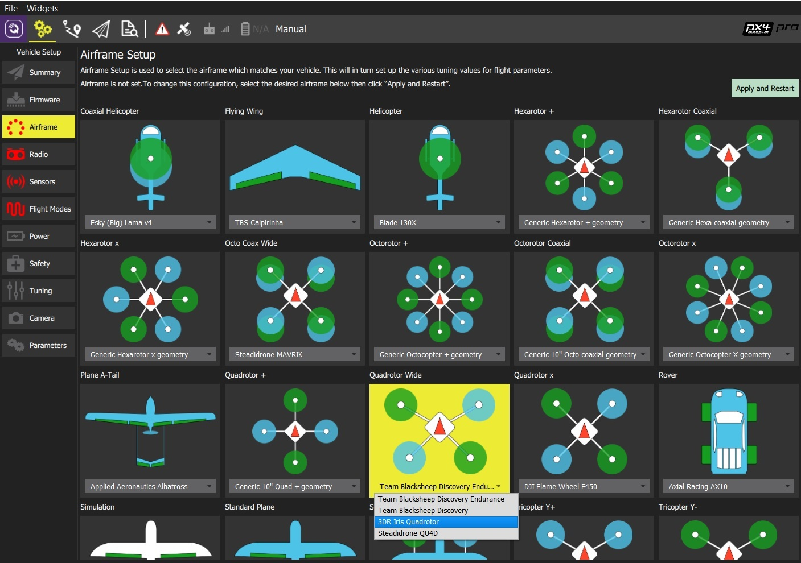
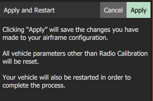
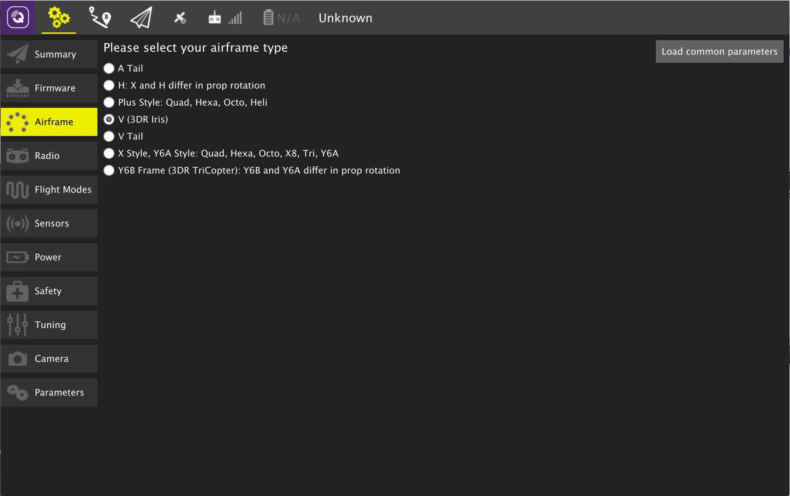
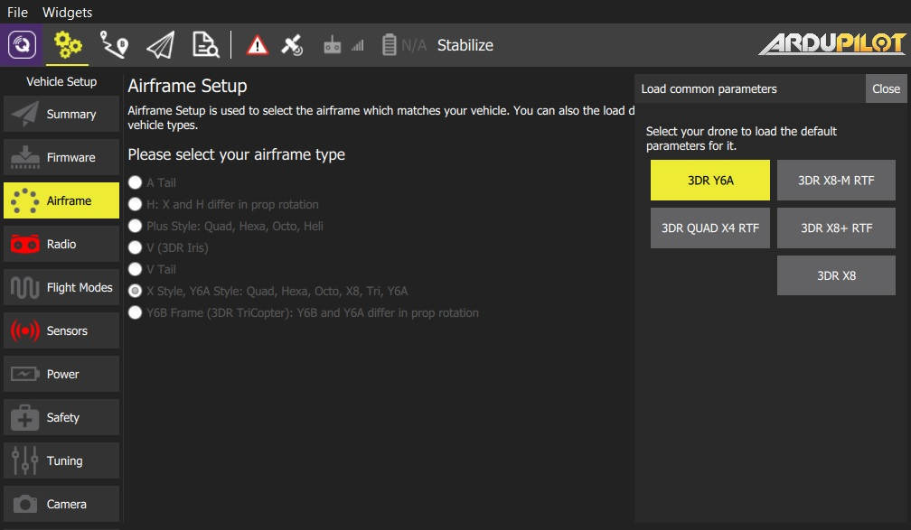

# Airframe Setup

이 페이지에서는 여러분의 비행체와 관련해서 주요 에어프레임 설정에 대해서 알아봅니다. 사용하는 flight controller 펌웨어에 따라서 관점이 달라집니다.

## PX4 Pro Airframe Setup

1. 먼저 상단 툴바에 있는 **Gear** 아이콘 (Vehicle Setup)을 선택하고 사이드바에서 **Airframe** 을 선택합니다.

1. airframe과 일치하는 group/type을 선택하고 group 내에 여러분의 비행체와 가장 잘 맞는 airframe을 선택하기 위해 드롭다운을 사용합니다.

   

   위에 예제에서는 *Quadrotor Wide* 그룹에서 *3DR Iris Quadrotor* 을 선택했습니다.

1. **Apply and Restart** 을 클릭합니다. 셋팅을 저장하기 위해서 다음 프롭프트에서 **Apply** 를 클릭하고 비행체를 재시작 시킵니다.

   

## ArduCopter Airfame Setup

> **Note** Airframe Setup은 *ArduCopter* 장치에서만 가능하빈다.(*ArduPilot* Rover나 Plane 장치에서는 보이지 않습니다.)

1. 먼저 상단 툴바에 있는 **Gear** 아이콘 (Vehicle Setup)을 선택하고 사이드바에서 **Airframe** 을 선택합니다.

1. 여러분의 비행체와 일치하는 프레임 type을 선택합니다. (라디오 버튼 선택해서 해당 선택을 적용합니다.)

   

   * 유명한 비행체 타입에 대해서는 파리미터 집합을 로드하기 위해서는 **Load common parameters** 을 클릭할 수 있습니다.

     

     > **Tip** 프롬프트를 닫으면 자동으로 솔정이 적용됩니다.
