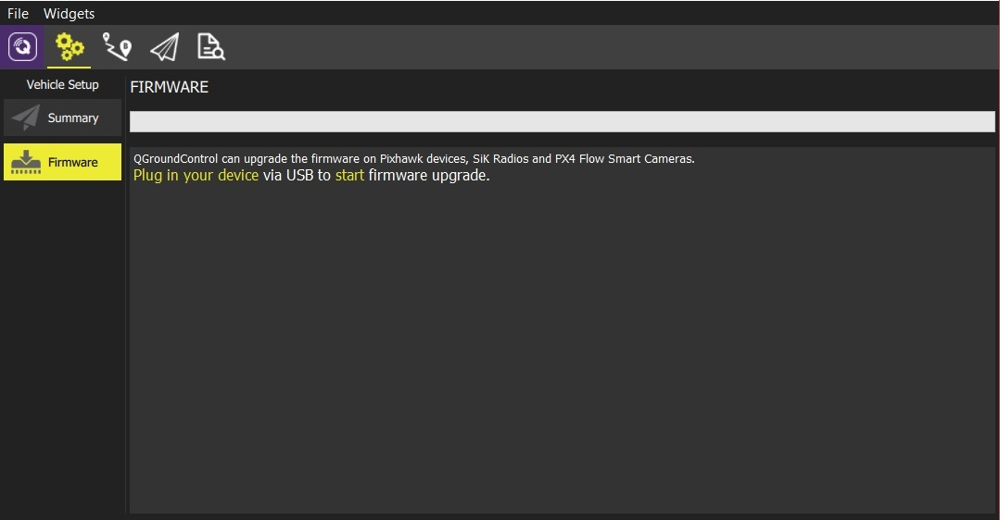
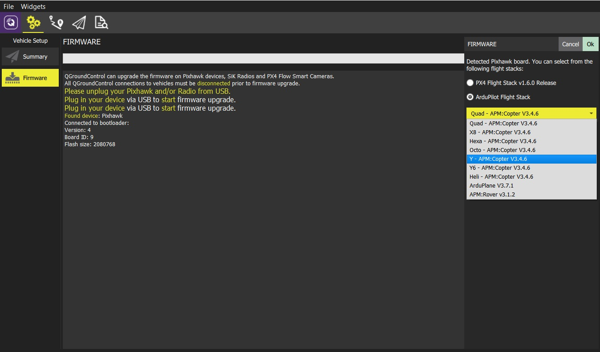
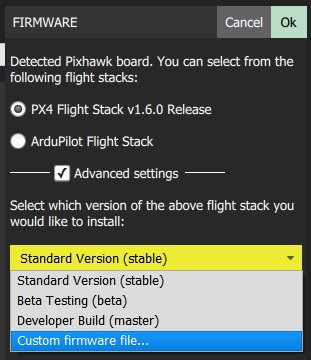
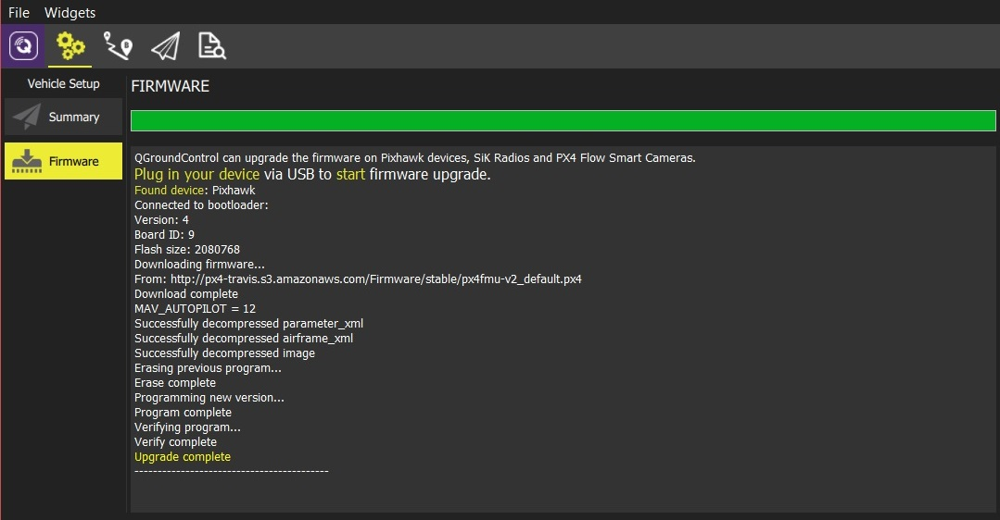

# 펌웨어 로딩하기

*QGroundControl* **데스크탑** 버전으로 [PX4 Pro](http://px4.io/) 나 [ArduPilot](http://ardupilot.com) 펌웨어를 Pixhawk호환 비행제어 보드에 설치할 수 있습니다. 기본적으로 QGC는 선택한 오토파일롯의 현재 안정 버전을 설치합니다. 하지만 베타 빌드, 데일리 빌드 아니면 커스텀 펌웨어 파일을 설치를 선택할 수도 있습니다.

*QGroundControl* 은 SiK Radios나 PX4 Flow 장치의 펌웨어를 설치할 수도 있습니다.

> **주의** 현재 타블릿이나 폼 버전의 *QGroundControl* 에서는 지원하지 않습니다.

## 펌웨어 업데이트를 위해 장치 연결

> **주의** **펌웨어 설치를 시작하기 전에** 비행체에 모든 USB 연결은 반드시 *연결이 해제* 되어 있어야 합니다.(직접 연결이나 텔레메트리 라디오를 통한 연결 모두) 비행체는 반드시 배터리에서 전원을 공급받으면 *안됩니다.*

1. 먼저 상단 툴바에 있는 **Gear** 아이콘 (Vehicle Setup)을 선택하고 사이드바에서 **Firmware** 를 선택합니다.

  

1. USB를 이용해서 여러분의 장치를(Pixhawk, SiK Radio, PX4 Flow) 컴퓨터에 연결합니다.

   > **Note** 직접 전원을 얻을 수 있는 USB 포트에 직접 연결(USB 허브를 사용하지 않고)

## 로드할 펌웨어 선택

일단 장치가 연결되어 있으면, 어떤 펌웨어를 로드할지를 택할 수 있습니다.(*QGroundControl* 는 연결된 하드웨어를 바탕으로 알맞는 옵션을 제공)

1. Pixhawk 호환 보드의 경우 현재 안정 버전을 다운로드하기 위해 *PX4 Pro* 나 *ArduPilot* 펌웨어를 선택합니다. 만약 *ArduPilot* 를 선택하면 비행체의 각 타입에 대해서 특정 펌웨어를 추가로 선택해야만 합니다. (아래와 같이)

   

1. 특정 개발자 릴리즈 버전을 선택하거나 로컬 파일 시스템에서 펌웨어를 설치하기 위해서 **Advanced settings** 확인

   

## 펌웨어 업데이트

1. **OK** 버튼을 클릭해서 업데이트를 시작

   펌웨어는 다양한 업그레이드 단계를 통해 처리됩니다.(새로운 펌웨어 다운로드, 기존 펌웨어 삭제 등) 각 단계에서 화면에 출력되고 전체 진행상황이 진행바에 표시됩니다.

   

일단 펌웨어의 로딩이 완료되면 장치는 리부트 후에 다시 연결됩니다. 다음으로 airframe을 설정해줍니다.(그리고 다음으로 센서, 라디오 등등)
